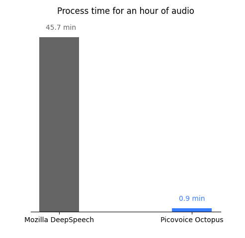

# Speech-to-Index Benchmark

Made in Vancouver, Canada by [Picovoice](https://picovoice.ai)

This is a minimalist and extensible framework for benchmarking different Speech-to-Index engines. It has been developed
and tested on Ubuntu 20.04 (x86_64) using Python3.8.

## Table of Contents

- [Speech-to-Index Benchmark](#speech-to-index-benchmark)
  - [Table of Contents](#table-of-contents)
  - [Background](#background)
  - [Data](#data)
  - [Metrics](#metrics)
    - [Missed Detection rate and False Alarm Per Hour](#missed-detection-rate-and-false-alarm-per-hour)
    - [Real Time Factor](#real-time-factor)
  - [Engines](#engines)
    - [Google speech-to-text](#google-speech-to-text)
    - [Mozilla DeepSpeech](#mozilla-deepspeech)
    - [Picovoice Octopus](#picovoice-octopus)
  - [Usage](#usage)
    - [Missed Detection Rate and False Alarm Per Hour Measurement](#missed-detection-rate-and-false-alarm-per-hour-measurement)
    - [Real Time Factor Measurement](#real-time-factor-measurement)
  - [Results](#results)

## Background

This framework has been developed by [Picovoice](http://picovoice.ai/) as part of the
[Octopus](https://github.com/Picovoice/octopus) project. Octopus is Picovoice's Speech-to-Index engine. It directly
indexes speech without relying on a text representation.

## Data

[TED-LIUM Release 3](https://openslr.org/51/) dataset is used for benchmarking.

## Metrics

This benchmark mainly considers three metrics: missed detection rate, false alarm per hour, and real-time factor.

### Missed Detection rate and False Alarm Per Hour

We measure the accuracy of the Speech-to-Index engines using false alarm per hour and missed detection rate. The false
alarm per hour is measured as a number of false positives in an hour. Missed detection is measured as the percentage of search phrases inside an audio file that an engine misses incorrectly.

### Real Time Factor

Real time factor (RTF) is measured as the ratio of CPU (processing) time to the length of the input speech file. An engine with lower RTF is more computationally efficient. We omit this metric for the cloud-based
Google speech-to-text engine.

## Engines

Since Octopus has no exact off-the-shelf counterpart that can search through audio files by indexing them, we use two well-known speech-to-text engines to transcript audio files first and then search inside the obtained text-based results.

### Google speech-to-text

A cloud-based speech recognition engine offered by Google Cloud Platform. Find more information
[here](https://cloud.google.com/speech-to-text/).

### Mozilla DeepSpeech

[Mozilla DeepSpeech](https://github.com/mozilla/DeepSpeech) is an open-source implementation of
[Baidu's DeepSpeech](https://arxiv.org/abs/1412.5567) by Mozilla.

### Picovoice Octopus

[Octopus](https://github.com/Picovoice/cheetah) is a Speech-to-Index engine developed using
[Picovoice's](http://picovoice.ai/) proprietary deep learning technology, which directly indexes speech without relying
on a text representation. It works offline and is supported on a growing number of platforms including Android, iOS,
and [web](https://picovoice.ai/demos/audio-search/).

## Usage

Below is information on how to use this framework to benchmark the mentioned engines.

1. Make sure that you have installed DeepSpeech on your machine by following the instructions on its official pages.
2. Install all required python packages by runnig `pip3 install -r requirements.txt` inside the terminal
3. Run the `config.py` script in order to download and unpack DeepSpeech's models
   under [resources/engines/deepspeech](/resources/engines/deepspeech).
4. Download [TED-LIUM Release 3](https://openslr.org/51/) and unpack it on your computer.
5. For running Google speech-to-text, you need to sign up and setup permissions /
   credentials according to its documentation. You also need to enable the 'Cloud speech-to-text' and 'Cloud storage' APIs
   and create a bucket for this benchmark. Running these services may incur fees.
6. For running Octopus, you need to get an `AccessKey` from the [Picovoice Console](https://picovoice.ai/console/).

### Missed Detection Rate and False Alarm Per Hour Measurement

These two metrics can be measured by running the following command from the root of the repository:

```bash
python3 benchmark.py --engines {ENGINES} --dataset_folder {DATASET_FOLDER} --access_key {ACCESS_KEY} --google_bucket_name {GOOGLE_BUCKET_NAME}
```

where `{DATASET_FOLDER}` is the path to the folder in which the `TEDLIUM`
dataset is extracted. The valid options for the `{ENGINES}`
parameter are: `MOZILLA_DEEP_SPEECH`, `GOOGLE_SPEECH_TO_TEXT`, and `PICOVOICE_OCTOPUS`. `{ACCESS_KEY}` or `{GOOGLE_BUCKET_NAME}` should be entered as the input only if the selected engine is Octopus or Google Speech-to-text respectively.

### Real Time Factor Measurement

Make sure all the git submodules are updated. Then, run the following command:

```bash
python3 realtime_factor.py --dataset_folder {DATASET_FOLDER} --access_key {ACCESS_KEY}
```

## Results

The benchmarking was performed on a Linux machine running Ubuntu 20.04 with 16GB of RAM and an Intel i7-10710U CPU running at 4.7 GHz.

The figure below compares the upper and lower ranges of the missed detection rates for all engines.
Octopus achieves the best performance by missing fewer occurrences of search phrases.


The figure below shows the false alarm per hour versus the missed detection rate for different confidence levels. `Mozilla DeepSpeech` does not provide the confidence level of the result in the same way that other engines deliver. Therefore, there is only one data point for it in the plot instead of a curve.

In addition, as shown by a red line, for around 1 false alarm per hour, Octopus achieves 22% for the missed detection rate while Google speech-to-text acquires 30%.


One important factor about Speech-to-Index engines is their processing speed. The figure below depicts the time an engine requires for processing an hour of audio.



